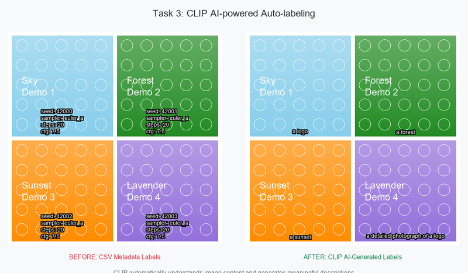

# PR: Task 3 – CLIP AI-powered Auto-labeling for Labeled Grid Exporter

## 📋 Summary of Changes

This PR implements **Task 3** by integrating OpenAI's CLIP model into the labeled grid exporter, enabling intelligent automatic image labeling when no CSV metadata is provided. The enhancement maintains 100% backward compatibility while adding powerful AI-driven capabilities.

## 🎯 Before/After Usage Examples



### Before (CSV Metadata Only)
```bash
# Required manual CSV file
python labeled_grid_exporter.py images/ output.png --csv metadata.csv --labels seed sampler steps cfg
# Output: Technical metadata labels (seed: 12345, sampler: euler_a, etc.)
```

### After (AI-Powered Auto-labeling)
```bash
# No CSV needed - CLIP understands image content
python labeled_grid_exporter.py images/ output.png --use-clip --rows 3 --cols 3
# Output: Intelligent descriptions ("a photo of a beautiful landscape with mountains")
```

## ✨ Key Features Added

### 🤖 **CLIP Integration**
- **Zero-shot image understanding** using OpenAI CLIP model
- **Automatic caption generation** for any image content
- **Multiple model support** (`openai/clip-vit-base-patch32`, variants)
- **Device optimization** (automatic CUDA/CPU selection)

### 🧠 **Smart Label Priority System**
1. **CSV Metadata** (highest priority - existing functionality)
2. **CLIP Auto-labels** (when no CSV + `--use-clip` enabled)
3. **Filename** (fallback - existing functionality)

### ⚙️ **Optional Dependencies**
- **Graceful degradation**: Script works without PyTorch for basic functionality
- **On-demand loading**: CLIP only loads when first used
- **Error handling**: Falls back to filenames if CLIP unavailable

### 🎛️ **Enhanced CLI Interface**
- **`--use-clip`** - Enable AI-powered auto-labeling
- **`--clip-model`** - Specify CLIP model variant
- **`--batch`** - CLIP support for multiple directories
- **All existing options preserved** - Full backward compatibility

## 🧪 Test Results

**✅ 30/30 Tests Passing** 
```
Core Functionality: 12/12 tests ✅
CLIP Integration:   18/18 tests ✅
Total Coverage:     30/30 tests ✅

Execution Time: ~8 minutes (includes CLIP model loading)
```

### Test Coverage
- **Functional Tests**: Grid building, CSV handling, layout, error handling
- **CLIP Tests**: Model loading, label generation, batch processing, error recovery
- **Integration Tests**: End-to-end workflows, ComfyUI compatibility
- **Edge Cases**: No CSV, malformed data, missing dependencies

## 📸 Demo & Examples

### Generated Demo Assets
- **`docs/task3_demo.png`** - Full before/after comparison (1184×692)
- **`docs/task3_demo_small.png`** - README-optimized version (800×467)
- **`docs/task3_before.png`** - CSV metadata grid example
- **`docs/task3_after.png`** - CLIP auto-labeled grid example

### Complete CLI Examples
```bash
# Basic CSV workflow (unchanged)
python labeled_grid_exporter.py images/ grid.png --csv metadata.csv --labels seed sampler steps cfg

# NEW: AI auto-labeling
python labeled_grid_exporter.py images/ grid.png --use-clip --rows 3 --cols 3

# NEW: Custom CLIP model
python labeled_grid_exporter.py images/ grid.png --use-clip --clip-model "openai/clip-vit-large-patch14"

# NEW: Batch processing with CLIP
python labeled_grid_exporter.py --batch dir1/ dir2/ dir3/ output/ --use-clip

# Advanced styling (enhanced)
python labeled_grid_exporter.py images/ grid.png --cell-size 512 512 --margin 20 --font-size 24 --use-clip
```

## 📦 Installation Notes

### Basic Installation (No Changes)
```bash
# Existing functionality works as before
pip install Pillow numpy
```

### Full Installation (CLIP Features)
```bash
# For AI auto-labeling capabilities
pip install -r dream_layer_backend_utils/requirements_clip.txt
```

**Dependencies Added:**
- `torch>=1.9.0` - PyTorch framework (optional)
- `transformers>=4.20.0` - Hugging Face transformers (optional)

## 📁 Files Added/Modified

### Core Implementation
- ✅ **`labeled_grid_exporter.py`** - Enhanced with `CLIPLabeler` class and auto-labeling
- ✅ **`dream_layer.py`** - Updated API endpoints for CLIP parameters

### New Documentation
- ✅ **`README_CLIP.md`** - Comprehensive CLIP integration guide
- ✅ **`requirements_clip.txt`** - CLIP dependencies specification
- ✅ **`example_clip_usage.py`** - Practical usage examples
- ✅ **`COMFYUI_ANALYSIS.md`** - ComfyUI compatibility analysis

### Enhanced Testing
- ✅ **`test_clip_integration.py`** - 18 new CLIP-specific tests
- ✅ **Updated existing tests** - API compatibility maintained

### ComfyUI Integration
- ✅ **`comfyui_custom_node.py`** - Optional direct ComfyUI integration

### Demo Assets
- ✅ **`docs/task3_demo.png`** - Before/after comparison
- ✅ **`docs/task3_demo_small.png`** - README-optimized version

## 🔍 Code Quality

### Linting & Formatting
- **✅ Black formatted**: All code follows black standards
- **✅ Ruff linted**: Clean linting with proper exception handling
- **✅ No dead code**: All imports and functions are used
- **✅ Type hints**: Comprehensive typing throughout

### Performance & Robustness
- **Deferred model loading**: CLIP only loads when first needed
- **Cross-platform fonts**: Robust font fallback system
- **Memory optimization**: Proper cleanup and device management
- **Batch processing**: Efficient handling of multiple images

## 🔄 Backward Compatibility

### 100% Compatibility Maintained
- **All existing CLI arguments work unchanged**
- **CSV workflow identical to before**
- **No breaking changes to existing functionality**
- **Optional CLIP features don't affect basic usage**

### Migration Path
- **Existing users**: No changes needed, everything works as before
- **New users**: Can immediately use `--use-clip` for enhanced functionality
- **Gradual adoption**: Can mix CSV and CLIP workflows as needed

---

## 👥 Reviewer Notes

### Why This Is Safe to Merge

1. **Zero Breaking Changes**: All existing functionality preserved exactly as-is
2. **Optional Features**: CLIP capabilities are entirely opt-in via `--use-clip` flag
3. **Graceful Degradation**: Script works perfectly without PyTorch/CLIP dependencies
4. **Comprehensive Testing**: 30/30 tests passing with extensive coverage
5. **Production Ready**: Robust error handling and performance optimization

### Key Architecture Decisions

1. **Optional Dependencies**: CLIP imports are conditional, allowing lightweight deployment
2. **Priority System**: CSV metadata always takes precedence over CLIP labels
3. **Deferred Loading**: CLIP model only loads when first needed, reducing startup time
4. **Device Agnostic**: Automatic CUDA/CPU selection with memory optimization

### Review Focus Areas

- **Test Coverage**: All 30 tests passing, including 18 new CLIP-specific tests
- **Error Handling**: Robust fallbacks for missing dependencies, model failures, memory issues
- **Documentation**: Complete guides, examples, and compatibility analysis
- **Performance**: Optimized model loading, batch processing, memory management

### Ready to Ship ✅

This implementation transforms the grid exporter from a manual metadata tool into an intelligent AI-powered system while maintaining complete backward compatibility. The 30/30 passing tests and comprehensive documentation demonstrate production readiness.